# Kubernetes RBAC: PlatformAdmin, AppDev, Auditor

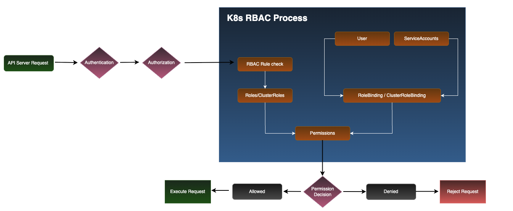

# Objective
    1. Deploy a local Kubernetes cluster using kind.
    2. Enable and verify RBAC.
    3. Design and implement three roles:
         - PlatformAdmin – cluster administrator, but restricted from accessing Secrets.
         - AppDev – can only manage applications in the team-a namespace.
         - Auditor – read-only access across the cluster.
    4. Validate access with kubectl auth can-i .
## Installation

Install docker

```bash
  sudo apt update

  #Install Required Packages 
  sudo apt install -y ca-certificates curl gnupg lsb-release

  #Add Docker’s Official GPG Key
  sudo mkdir -p /etc/apt/keyrings
  curl -fsSL https://download.docker.com/linux/ubuntu/gpg | sudo gpg --dearmor -o /etc/apt/keyrings/docker.gpg

  #Set Up the Repository
  echo \
  "deb [arch=$(dpkg --print-architecture) signed-by=/etc/apt/keyrings/docker.gpg] \
  https://download.docker.com/linux/ubuntu $(lsb_release -cs) stable" | \
  sudo tee /etc/apt/sources.list.d/docker.list > /dev/null

  #Install Docker Engine
  sudo apt install -y docker-ce docker-ce-cli containerd.io docker-buildx-plugin docker-compose-plugin

  #verify
  docker --version
```

Install Kubectl

``` bash
  curl -LO "https://dl.k8s.io/release/$(curl -Ls https://dl.k8s.io/release/stable.txt)/bin/linux/amd64/kubectl"
  chmod +x kubectl && sudo mv kubectl /usr/local/bin/
  kubectl version --client
```

Install Kind

``` bash
  curl -Lo ./kind https://kind.sigs.k8s.io/dl/v0.30.0/kind-linux-amd64
  chmod +x ./kind
  sudo mv ./kind /usr/local/bin/kind
  kind --version
```

Create a local cluster

``` bash
  kind create cluster --name secops-rbac
```
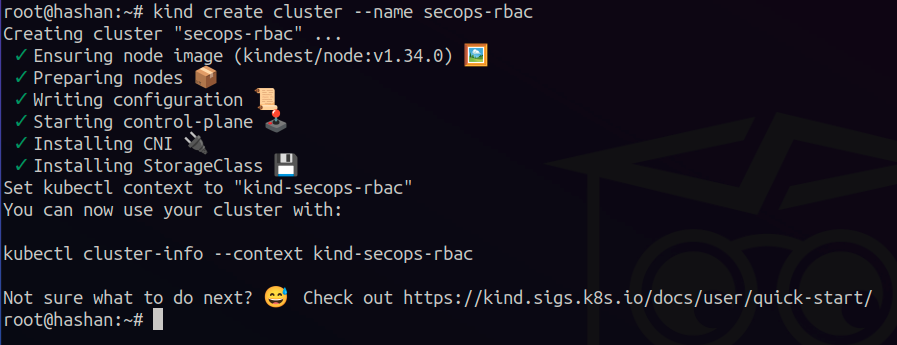

Verify RBAC enabled

``` bash
  kubectl api-versions | grep rbac.authorization.k8s.io
```
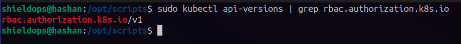

Create namespaces using namespaces.yaml file

``` bash
  sudo kubectl apply -f namespaces.yaml
```
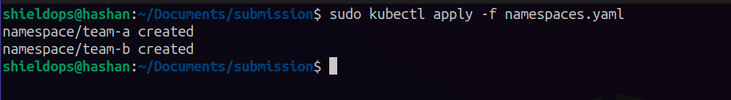

Create ServiceSccounts for each role using serviceaccounts.yaml file

``` bash
  sudo kubectl apply -f serviceaccounts.yaml
```
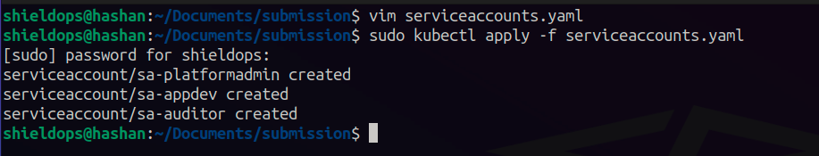

## RBAC Policy

Check exisitng api resources and used it when creating the RBAC policy.

``` bash
  sudo kubectl api-resources
```
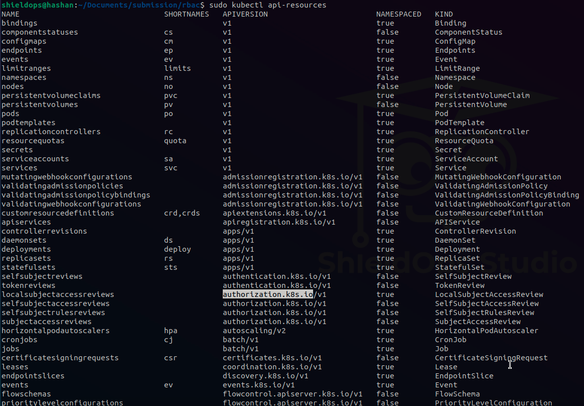

AppDev: can modify Deployments in team-a, but cannot access secrets or resources in other namespaces.
Create Role & RoleBinding using following commands

``` bash
  sudo kubectl apply -f role-appdev-team-a.yaml
  sudo kubectl apply -f sudo kubectl apply -f role-appdev-team-a.yaml
```
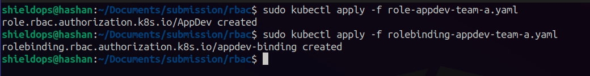

PlatformAdmin: can manage cluster, but cannot read secrets.
Create ClusterRole & ClusterRoleBinding using following commands

``` bash
  sudo kubectl apply -f clusterrole-platformadmin.yaml
  sudo kubectl apply -f sudo kubectl apply -f clusterrole-platformadmin.yaml
```
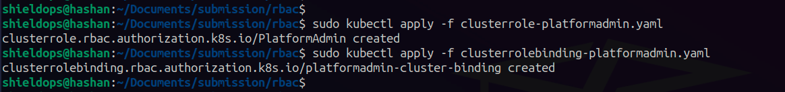

Auditor: can list Pods accross all namespaces, but cannot create or delete resources.
Create ClusterRole & ClusterRoleBinding using following commands

``` bash
  sudo kubectl apply -f clusterrole-auditor.yaml
  sudo kubectl apply -f sudo kubectl apply -f clusterrolebinding-auditor.yaml
```


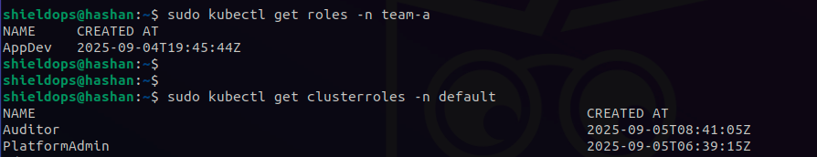

## Test Application

Deploy simple nginx app in team-a namespaces

``` bash
  sudo kubectl apply -f nginx.yaml
  sudo kubectl get pods -n team-a
  sudo kubectl get services -n team-a
```
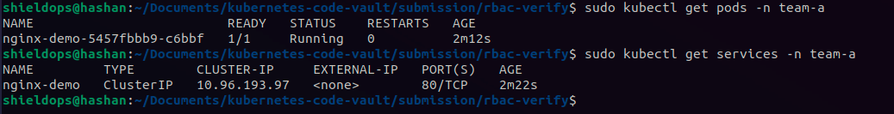

## Access Verification

Run permission checks using kubectl auth can-i

``` bash
  #PlatformAdmin

  sudo kubectl auth can-i create namespace --as=system:serviceaccount:kube-system:sa-platformadmin
  sudo kubectl create ns team-c --as=system:serviceaccount:kube-system:sa-platformadmin
  sudo kubectl delete ns team-c --as=system:serviceaccount:kube-system:sa-platformadmin
  sudo kubectl auth can-i get secrets --as=system:serviceaccount:kube-system:sa-platformadmin

  #AppDev
  sudo kubectl apply -n team-a -f nginx.yaml --as=system:serviceaccount:team-a:sa-appdev
  sudo kubectl auth can-i patch deployments.app -n team-a --as=system:serviceaccount:team-a:sa-appdev
  sudo kubectl auth can-i get secrets -n team-a --as=system:serviceaccount:team-a:sa-appdev
  sudo kubectl auth can-i create deployments.app -n default --as=system:serviceaccount:team-a:sa-appdev
  sudo kubectl auth can-i get pods -n default --as=system:serviceaccount:team-a:sa-appdev

  #Auditor
  sudo kubectl auth can-i get pods -A --as=system:serviceaccount:default:sa-auditor
  sudo kubectl auth can-i create pods -n default --as=system:serviceaccount:default:sa-auditor
  sudo kubectl auth can-i delete services -n team-a --as=system:serviceaccount:default:sa-auditor
  sudo kubectl auth can-i create pods/exec -n team-a --as=system:serviceaccount:default:sa-auditor
```

Above test cases can be run using following script

``` bash
  sudo ./verify.sh
```
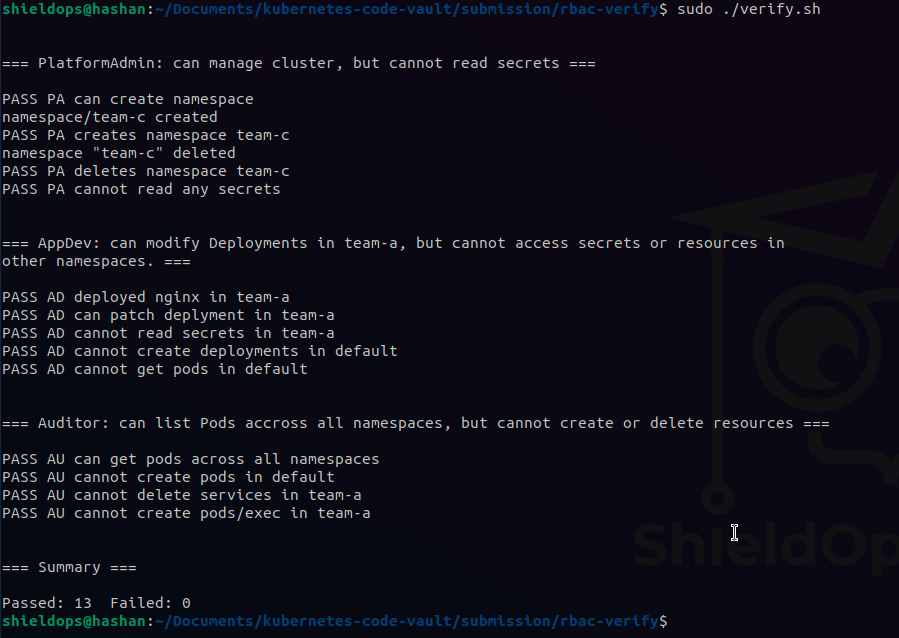


